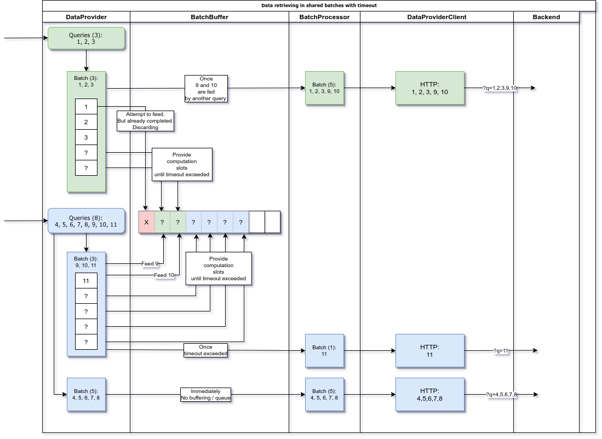
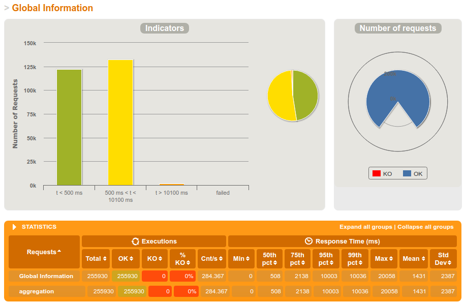
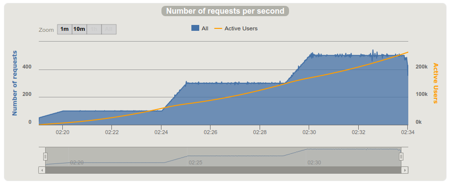

Aggregation Service Guideline
---

# Description
This API service aggregates data from multiple data providers, merges it into single response
and exposes back to the client. 

# Technology stack
- Java 11 (Completable Futures)
- Spring Boot
- Lombok
- JUnit 4
- AssertJ
- Mockito
- okhttp3 (mocking web server in integration tests)
- Testcontainers (mocking web server in integration tests)
- Gatling

# Solution
## Processing requests asynchronously
To avoid blocking request processing I decided to use CompletableFuture from Java Core.

It allows to:
- submit completable future per each query (requested id)
- asynchronously process it in non-blocking manner
- once result per query is received - publish it back
- handle result and return response to the client

As result threads spend more time on CPU computations and less time awaiting other operations to be finished.
Splitting operations on smaller asynchronous computations allows distributing load efficiently over available cores.

## Aggregation Service
This component submits requests for multiple Data Providers (more can be added).
Then once all results per query received back - merges them into single generic response, so it's ready to be send back to the user.
In case any data provider is not able to process submitted request - returns empty values for corresponding queries.

## Data Provider
This is the most interesting part of this service.
Here on the diagram bellow you can see how Data Provider is processing multiple parallel queries.

Here are main points:
- first split all queries on batches with a capacity of maximum allowed queries in single request per data provider.
- complete batches - immediately sent to backend over HTTP using non-blocking web client
- an incomplete batch follows this algorithm:
    - first it tries to feed as many as possible queries into other batches awaiting they are completed or timeout reached
    - if anything left, it provides all available slots, so other incoming batches can feed their queries into it
    - once all slots are fed by other batches, it is completed and ready to be sent
    - OR, if awaiting timeout exceeded, batch will be processed with empty slots, nothing can feed it anymore 
    - if nothing left inside the batch, it is discarded

Where batch is actually a group of completable futures. Batch Processor is writing collected results into it.
And on the other end - AggregationService is awaiting these results asynchronously to build final response for user.



Here on the diagram:
1. An incomplete batch with 3 queries appears
2. It tries to feed its queries into available slots, but one found is completed/expired already, so discards it
3. Then it provides 2 available slots and awaits if any new batch can feed in it
4. Big batch with 8 queries appears
5. First 5 queries form complete batch and are immediately sent.
6. Next, it feeds 2 queries into the small batch. So completes it and small batch is ready to be sent as well.
7. Then, it provides 4 left available slots - in case other parallel batches going to feed queries in it
8. Once timeout reached - all slots are expired, batch became completed and is ready to be sent with one single query in it

In fact this buffer does no really grow much over batch capacity. 


## ForkJoinPool vs custom thread pool
CompletableFuture uses shared ForkJoinPool.common() underneath. This pool has a fixed size based on number of processor's cores.
It means blocking long-running time-consuming operations should not run on it.
Solution is to use non-blocking WebClient from Spring WebFlux.
In case any blocking long-running operations required / identified - custom thread with larger number of threads should be used for them.

# Performance specification
## Setup
Load tests ran on:
- Intel® Core™ i7-8565U CPU @ 1.80GHz × 8
- 16 Gb Memory
- Ubuntu 18.04.4

Top QPS: 500+
(I just didn't try higher - cause worry about my laptop :D)

## Results
Here are charts showing response time distribution and RPS.

More information on report is available here:
`aggregator-load-tests/report/index.html`




# Build and unit testing
```shell script
cd $PROJECT_DIR
mvn clean install
```

# Run integration tests
There is only one integration test. I liked this approach with stubs for backend services in containers.
So decided to re-use it inside my integration tests by running under Testcontainers utility.

Important: as result it requires preinstalled docker.
```shell script
cd $PROJECT_DIR 
mvn verify -P integration
```

# Start application
First, run stubbed backend services in docker container:
```shell script
docker run -it -p 80:8080 xyzassessment/backend-services
```

By default, API expects backend services to run on localhost:80.
This is possible to change by updating settings in application.yml (and rebuilding project) or by passing system properties.

To run application as jar file:
```shell script
cd $PROJECT_DIR
java -jar aggregator-web/target/aggregator-web-1.0.0-SNAPSHOT.jar
```

# Execute query
```shell script
curl -v "http://localhost:8080/aggregation?pricing=NL&track=123456789&shipments=987654321"
```

# Running load tests
```shell script
cd $PROJECT_DIR/aggregator-load-tests
mvn gatling:test
```